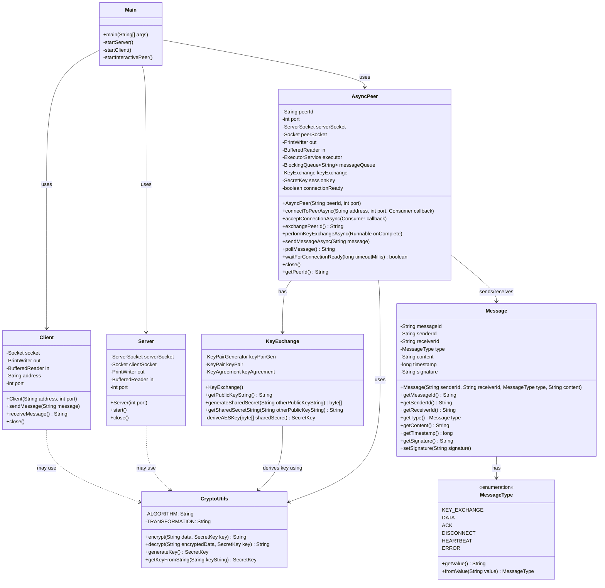
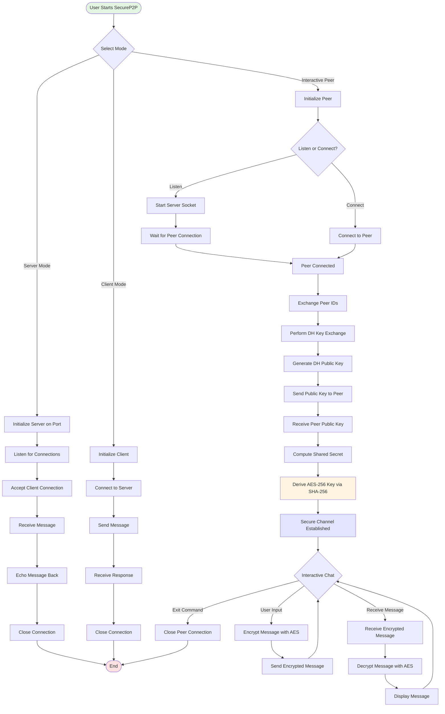
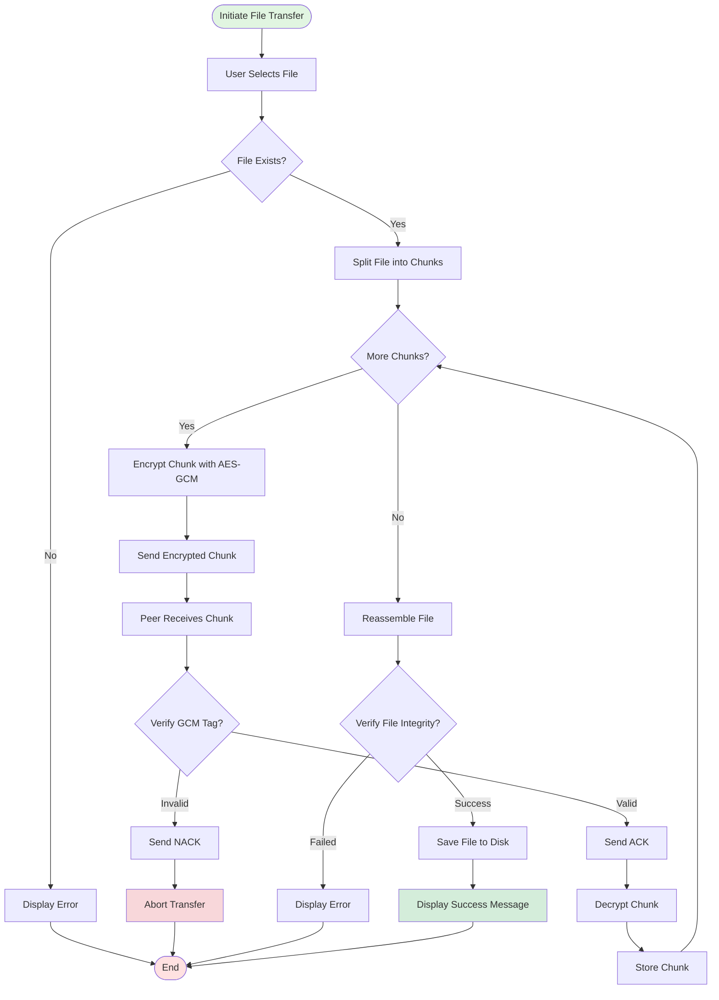
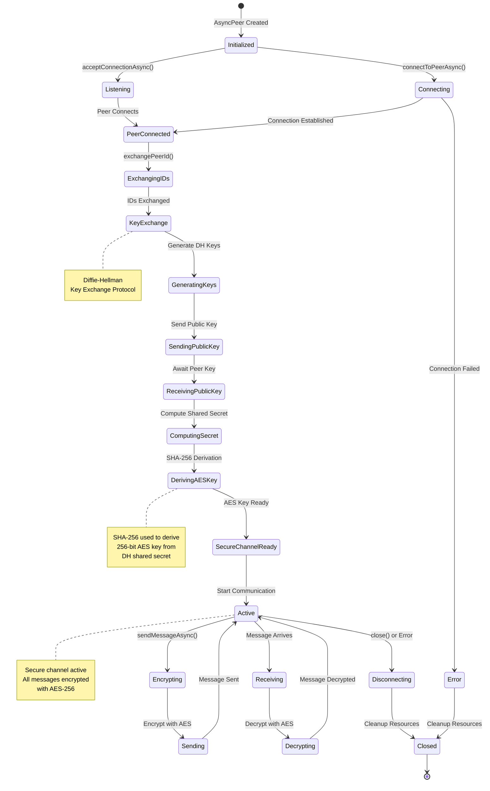
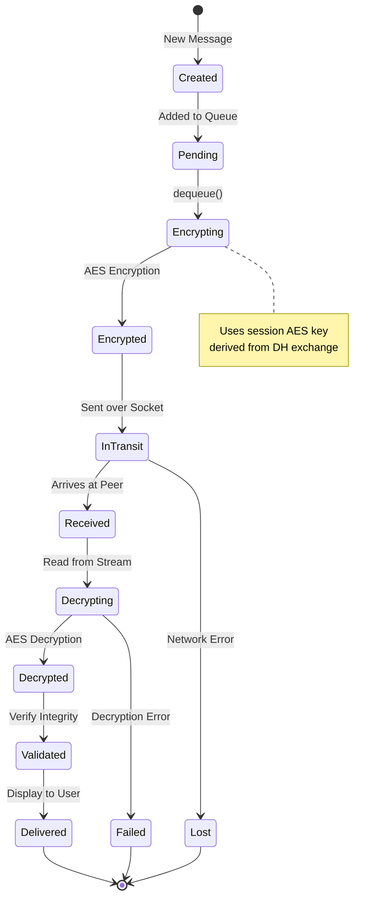
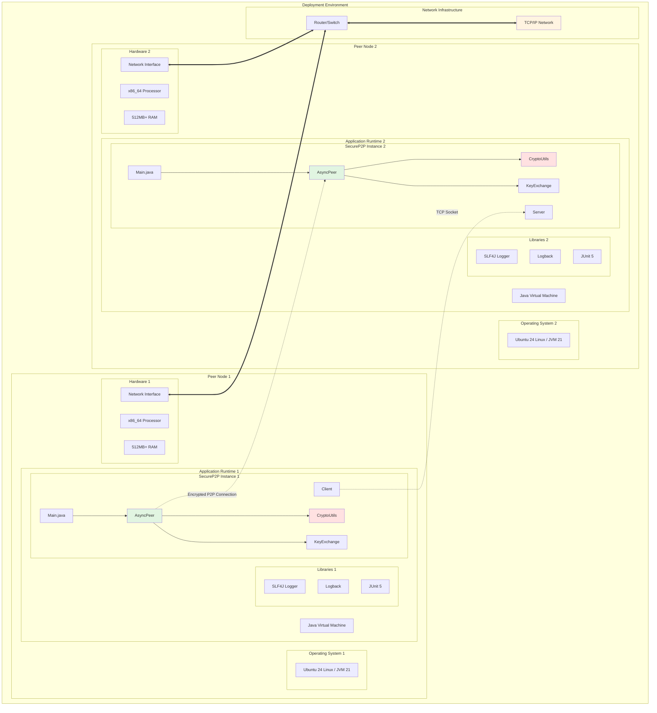
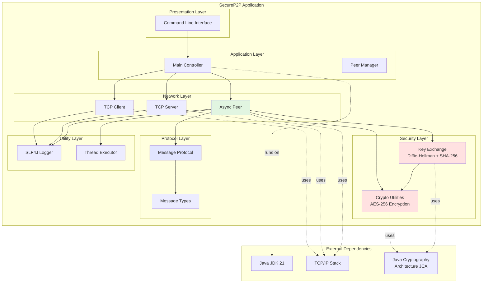
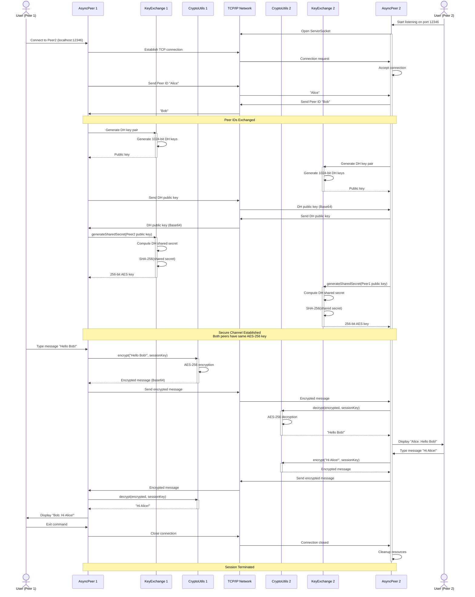
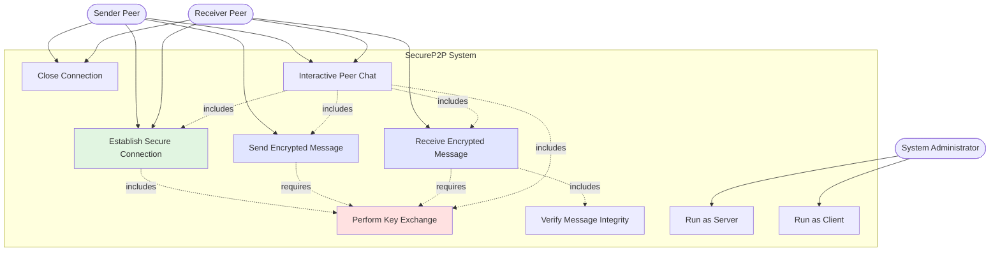

# SecureP2P UML Diagrams

## 1. Class Diagram

## 2. Activity Diagram - Secure P2P Communication Flow

## 3. Activity Diagram - File Transfer (Future Enhancement)

## 4. Statechart Diagram - AsyncPeer State Machine

## 5. Statechart Diagram - Message Lifecycle

## 6. Deployment Diagram

## 7. Component Diagram

## 8. Sequence Diagram - Complete P2P Session

## 9. Use Case Diagram

