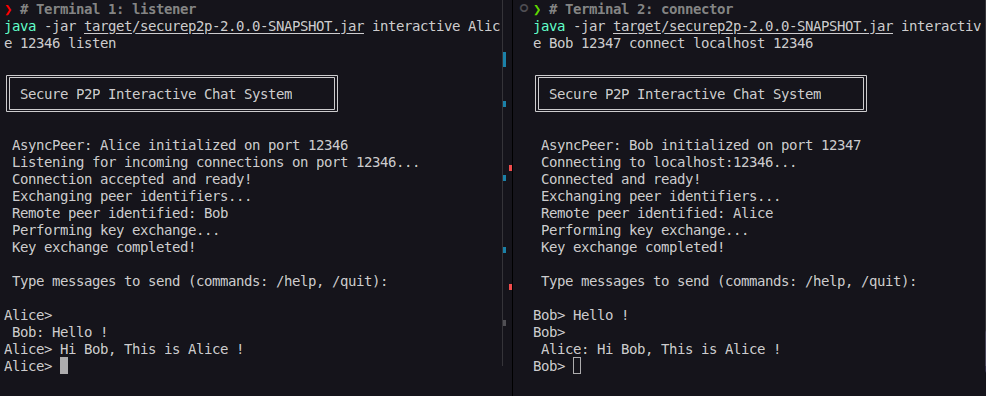

# SecureP2P Java

SecureP2P is a Java 21 peer-to-peer messaging project with asynchronous TCP connections, a post-quantum session bootstrap, and authenticated payload encryption.

The active peer path uses ML-KEM-768 to establish session material and AES-256-GCM to protect messages. The codebase is organized around focused networking, session, listener, and cryptography modules so the protocol can continue evolving cleanly.



## Quick Start

Requirements: JDK 21 and Maven 3.6 or newer.

```bash
mvn clean test
mvn package
```

Start an interactive encrypted peer session in two terminals:

```bash
# Terminal 1: listener
java -jar target/securep2p-2.0.0-SNAPSHOT.jar interactive Alice 12346 listen

# Terminal 2: connector
java -jar target/securep2p-2.0.0-SNAPSHOT.jar interactive Bob 12347 connect localhost 12346
```

Use `/help`, `/status`, `/clear`, `/quit`, or `/bye` in the chat. The application reports connection success after asynchronous stream initialization and starts chat after the encrypted session handshake completes. The application exposes peer mode only; archived `Client` and `Server` classes remain in the legacy package for reference.

## What Is Implemented

- `Main`: peer-only command-line entry point with `peer` and `interactive` modes.
- `AsyncPeer`: asynchronous accept/connect operations, peer-ID exchange, ML-KEM-768 session bootstrap, AES-GCM sends, a receive queue, and callbacks.
- `PeerConnection`, `SessionManager`, and `MessageListener`: separated transport, session, and inbound-delivery responsibilities.
- `AeadCrypto`: explicit AES-256-GCM encryption with random nonces and authenticated associated data.
- `MlKemKeyExchange`: Bouncy Castle-backed ML-KEM-768 encapsulation and decapsulation.
- `com.zerotrust.legacy`: archived DH/AES and plaintext echo classes retained for historical comparison.

## Documentation

- [High-level architecture](docs/high-level-architecture.md): components, responsibilities, and end-to-end flows.
- [Module-level design](docs/module-level-design.md): package boundaries, class diagrams, dependencies, state model, and message paths.
- [Architecture and security decisions](docs/decisions.md): decisions taken, rationale, alternatives, consequences, and pending gates.
- [Low-level design and API](docs/low-level-design.md): classes, state transitions, wire format, threading, and usage contracts.
- [Security notes](docs/security.md): implemented protections, protocol boundaries, and hardening roadmap.
- [Development and testing](docs/development.md): project layout, Maven commands, test scope, and contribution guidance.
- [Operations and troubleshooting](docs/operations.md): runtime behavior, ports, failure modes, and cleanup.

## Repository Layout

```text
pom.xml                         Maven build and dependency configuration
src/main/java/com/zerotrust      Application, networking, and crypto code
src/test/java/com/zerotrust      JUnit tests for crypto and AsyncPeer behavior
src/main/java/com/zerotrust/legacy Archived pre-v2 classes for comparison
docs/                            Maintained project documentation
```

Generated output under `target/` is not source documentation and should not be committed.

## Testing

Run the complete test suite:

```bash
mvn test
```

Run focused suites:

```bash
mvn test -Dtest=PqcCryptoTest
mvn test -Dtest=AsyncPeerTest
```

The tests cover ML-KEM agreement, AES-GCM authentication, peer connection setup, peer-ID exchange, PQC session bootstrap, callbacks, message delivery, cleanup, and archived legacy primitives. The test count is determined by the current source, so documentation intentionally does not hard-code an expected number.

## Project Status

SecureP2P currently focuses on direct peer chat over TCP. Runtime configuration is supplied through command-line arguments, and the active application path is the asynchronous peer mode in `Main`.

The cryptographic migration has moved the active session path to ML-KEM-768 and AES-256-GCM through `SessionManager`. Next protocol milestones include authenticated peer identity, version negotiation, replay handling, and ratchet-managed key evolution.

SLF4J and Logback are declared in Maven for logging integration work; the command-line application currently writes directly to standard output and standard error.

## Protocol Roadmap

Planned protocol work is tracked in [Architecture and Security Decisions](docs/decisions.md):

- Bind ML-KEM handshakes to authenticated peer identities.
- Add versioned framing with authenticated capability negotiation.
- Add replay handling, message counters, and bounded malformed-frame handling.
- Introduce a reviewed ratchet construction for key evolution.
- Expand negative tests for identity, tampering, replay, downgrade, malformed frames, and timeout behavior.

Treat changes to the wire protocol and cryptographic transformations as compatibility and security changes. Update the relevant documentation and tests in the same change.

## License

See [LICENSE](LICENSE).
