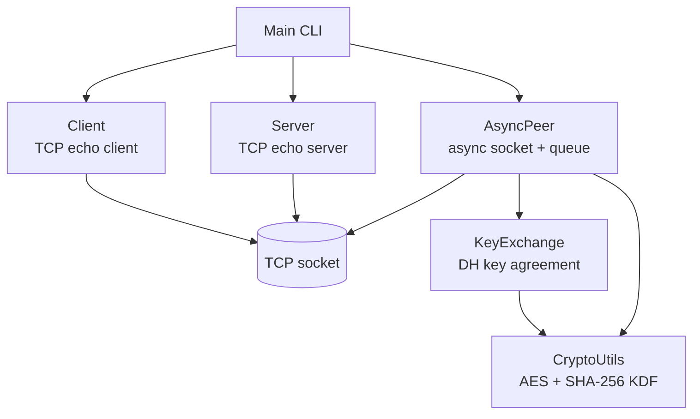
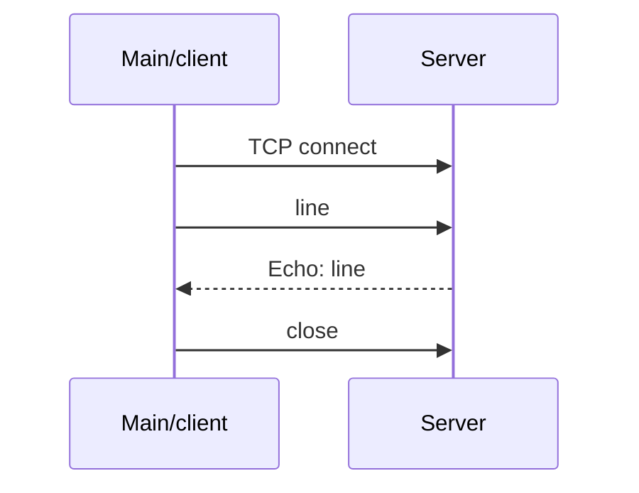
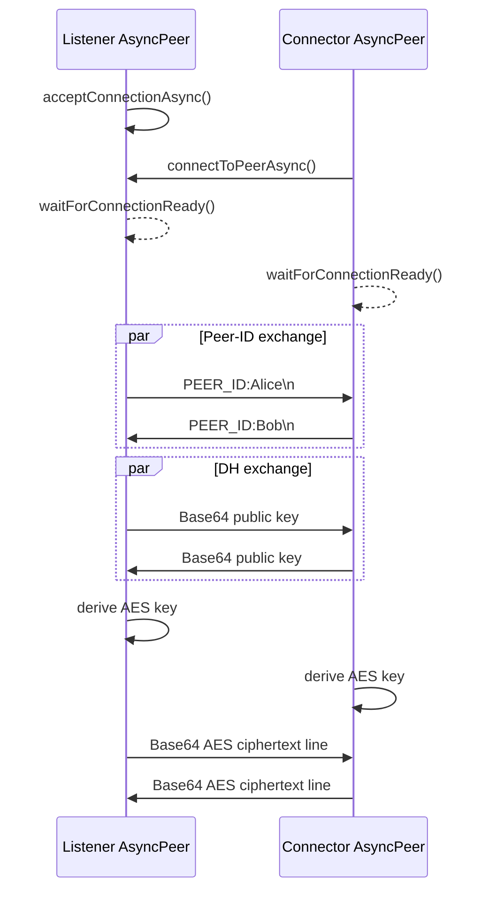

# High-Level Architecture

## Purpose and boundaries

SecureP2P is a single-process Java application that opens direct TCP sockets between two processes. It has two demonstrations:

1. A synchronous client/server echo path.
2. An asynchronous peer path that exchanges identifiers and derives a shared AES key before chat messages are normally sent.

There is no broker, directory service, persistence layer, account system, or certificate authority.

## Component view

### Application layer

`com.zerotrust.Main` parses positional command-line arguments and coordinates the selected demonstration. Interactive mode creates an `AsyncPeer`, waits for a connection, exchanges peer IDs, starts key exchange, and enters a terminal chat loop.

### Networking layer

- `Client` connects immediately in its constructor, sends lines, reads responses, and closes one socket.
- `Server` binds in its constructor, accepts one client in `start()`, and echoes each received line until EOF.
- `AsyncPeer` binds a local `ServerSocket` in its constructor, then performs accept/connect work on an executor. After key exchange it starts a daemon reader thread and dispatches decryption/callback work through the executor.

### Cryptography layer

- `KeyExchange` creates a 1024-bit finite-field DH key pair and serializes public keys as Base64-encoded X.509 bytes.
- `CryptoUtils` derives a 256-bit AES key by hashing the Base64 shared-secret string with SHA-256.
- `CryptoUtils.encrypt` and `decrypt` use the provider-default `AES` transformation. The exact mode/padding is therefore provider-dependent; on standard JDK providers this resolves to ECB with PKCS5/PKCS7-style padding.

## Main flows

### Echo flow

### Encrypted peer flow

Both peers must perform the blocking handshake operations concurrently where noted.

`AsyncPeer` queues the received wire line immediately. Its message callback receives a separately decrypted value. This means queue consumers and callback consumers observe different representations.

## Architectural constraints

- One `AsyncPeer` owns one listening socket and one active peer socket.
- The protocol is line-delimited and cannot safely carry arbitrary unescaped newlines.
- The current CLI uses fixed defaults: echo mode uses port `12345`; interactive mode defaults to local port `9000`, listen mode, and generated peer ID.
- There is no version field or negotiation step in the wire protocol.

For implementation details, see [Low-Level Design](low-level-design.md). For security implications, see [Security Notes](security.md).
