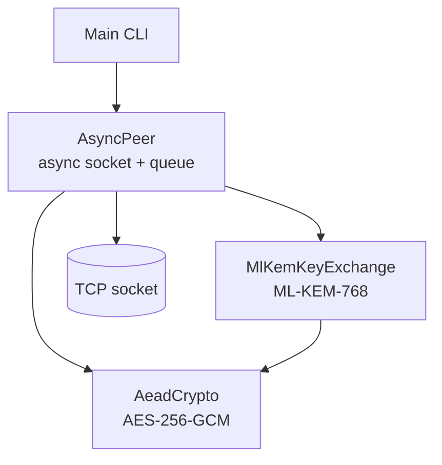
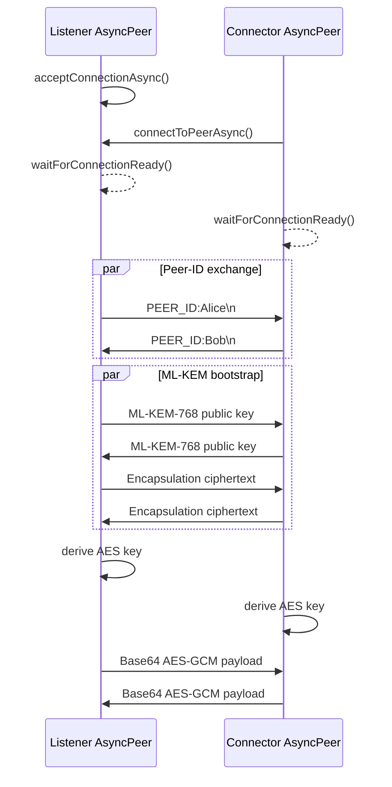

# High-Level Architecture

## Purpose and boundaries

SecureP2P is a single-process Java application that opens direct TCP sockets between two peer processes. The supported application path is asynchronous peer chat; the legacy echo classes are archived under `com.zerotrust.legacy` and are not exposed as CLI modes.

There is no broker, directory service, persistence layer, account system, or certificate authority.

## Component view

### Application layer

`com.zerotrust.Main` parses positional command-line arguments and coordinates the selected demonstration. Interactive mode creates an `AsyncPeer`, waits for a connection, exchanges peer IDs, starts key exchange, and enters a terminal chat loop.

### Networking layer

- `PeerConnection` owns the local `ServerSocket`, active peer socket, streams, readiness, and transport shutdown.
- `SessionManager` owns peer-ID exchange, ML-KEM bootstrap, session-key derivation, and AES-GCM payload protection.
- `MessageListener` owns inbound reading, queueing, decryption dispatch, callbacks, and listener shutdown.
- `AsyncPeer` coordinates those modules through a compatibility façade.

### Cryptography layer

- `MlKemKeyExchange` creates ML-KEM-768 key pairs and performs encapsulation/decapsulation through Bouncy Castle.
- `SessionManager` derives a session key from the ordered KEM secrets and a protocol context.
- `AeadCrypto` encrypts message bytes with explicit AES-256-GCM, random nonces, and authenticated associated data.

## Main flows

### Peer flow

Both peers must perform the blocking handshake operations concurrently where noted.

`MessageListener` queues the received wire line immediately. Its message callback receives a separately decrypted value. This compatibility behavior remains documented until the v2 session API replaces raw-wire polling.

## Architectural constraints

- One `AsyncPeer` façade owns one `PeerConnection`, one `SessionManager`, and one `MessageListener` for a single active peer session.
- The protocol is line-delimited and cannot safely carry arbitrary unescaped newlines.
- The current CLI defaults to local port `9000`, listen mode, and a generated peer ID.
- The line protocol has ML-KEM frame prefixes but does not yet provide authenticated capability negotiation or downgrade rejection.

For package boundaries and diagrams, see [Module-Level Design](module-level-design.md). For method-level implementation details, see [Low-Level Design](low-level-design.md). For security implications, see [Security Notes](security.md).
