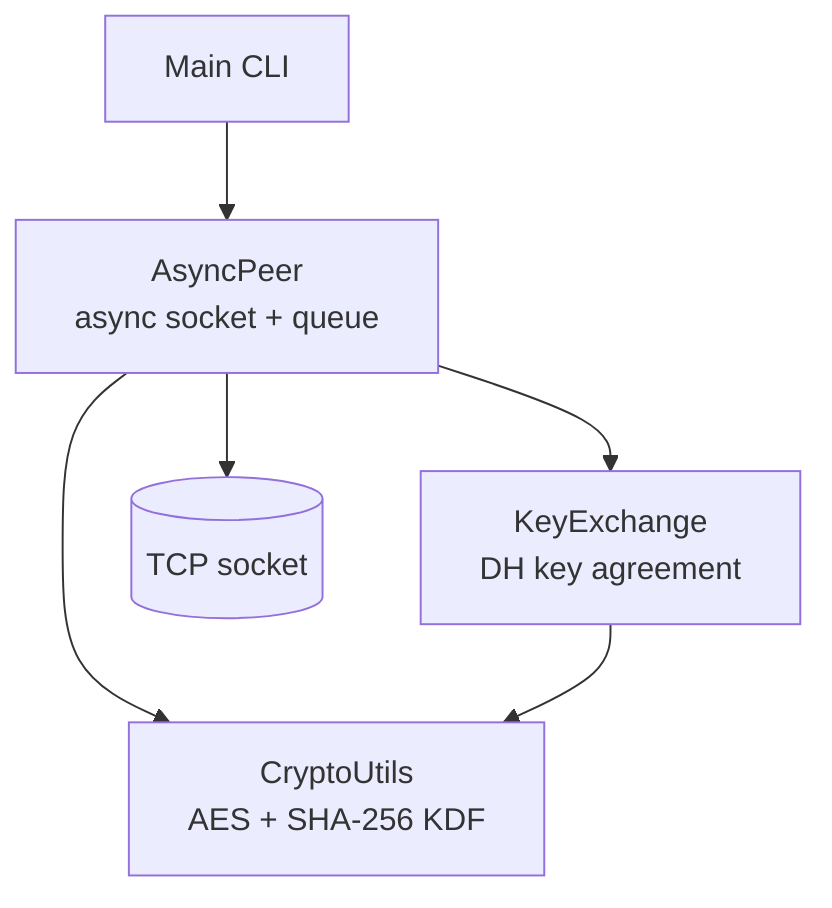
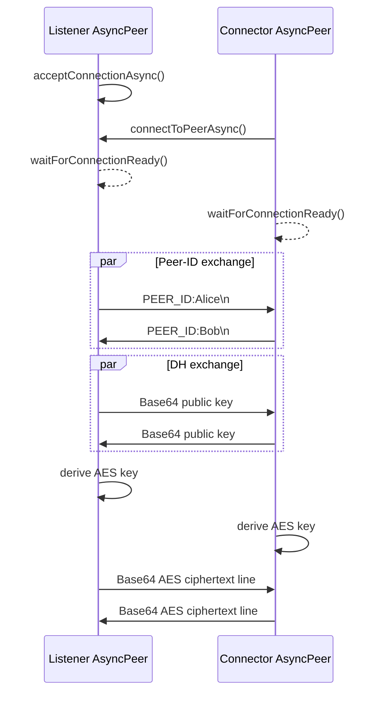

# High-Level Architecture

## Purpose and boundaries

SecureP2P is a single-process Java application that opens direct TCP sockets between two peer processes. The supported application path is asynchronous peer chat; the legacy `Client` and `Server` classes remain source-level examples but are no longer exposed as CLI modes.

There is no broker, directory service, persistence layer, account system, or certificate authority.

## Component view

### Application layer

`com.zerotrust.Main` parses positional command-line arguments and coordinates the selected demonstration. Interactive mode creates an `AsyncPeer`, waits for a connection, exchanges peer IDs, starts key exchange, and enters a terminal chat loop.

### Networking layer

- `PeerConnection` owns the local `ServerSocket`, active peer socket, streams, readiness, and transport shutdown.
- `SessionManager` owns peer-ID exchange and the current session key lifecycle.
- `MessageListener` owns inbound reading, queueing, decryption dispatch, callbacks, and listener shutdown.
- `AsyncPeer` coordinates those modules through a compatibility façade.

### Cryptography layer

- `KeyExchange` creates a 1024-bit finite-field DH key pair and serializes public keys as Base64-encoded X.509 bytes.
- `CryptoUtils` derives a 256-bit AES key by hashing the Base64 shared-secret string with SHA-256.
- `CryptoUtils.encrypt` and `decrypt` use the provider-default `AES` transformation. The exact mode/padding is therefore provider-dependent; on standard JDK providers this resolves to ECB with PKCS5/PKCS7-style padding.

## Main flows

### Peer flow

Both peers must perform the blocking handshake operations concurrently where noted.

`MessageListener` queues the received wire line immediately. Its message callback receives a separately decrypted value. This compatibility behavior remains documented until the v2 session API replaces raw-wire polling.

## Architectural constraints

- One `AsyncPeer` façade owns one `PeerConnection`, one `SessionManager`, and one `MessageListener` for a single active peer session.
- The protocol is line-delimited and cannot safely carry arbitrary unescaped newlines.
- The current CLI uses fixed defaults: echo mode uses port `12345`; interactive mode defaults to local port `9000`, listen mode, and generated peer ID.
- There is no version field or negotiation step in the wire protocol.

For package boundaries and diagrams, see [Module-Level Design](module-level-design.md). For method-level implementation details, see [Low-Level Design](low-level-design.md). For security implications, see [Security Notes](security.md).
