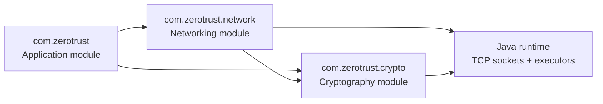
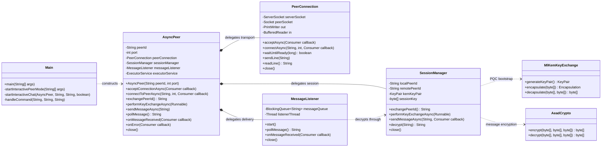
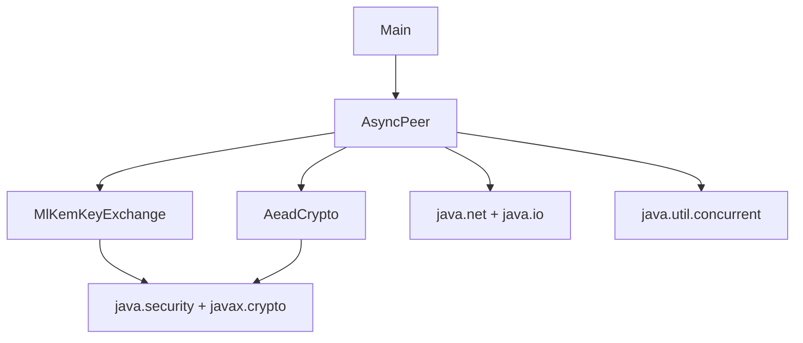
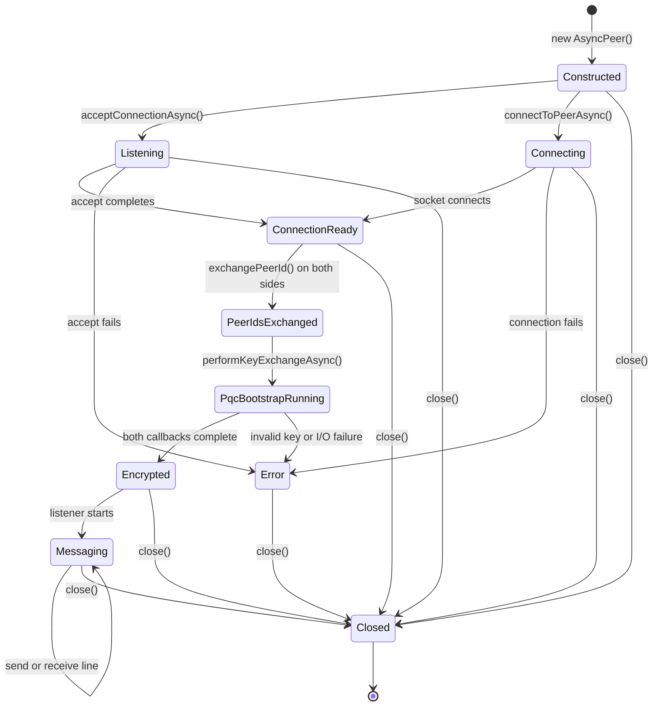

# Module-Level Design

This document describes the codebase at package, class, and interaction level. The diagrams are intentionally limited to classes and relationships that exist in `src/main/java`.

Design rationale and unresolved security gates are tracked in [Architecture and Security Decisions](decisions.md).

## Module map



### `com.zerotrust`

**Owner:** `Main`

Responsibilities:

- Parse command-line mode and positional arguments.
- Construct and coordinate `AsyncPeer`.
- Run the terminal chat loop and interpret chat commands.
- Display status and errors to standard output/error.

This module is an application/composition layer. It should not own cryptographic primitives or socket framing logic.

### `com.zerotrust.network`

**Owners:** `AsyncPeer`, `PeerConnection`, `SessionManager`, and `MessageListener`

Responsibilities:

- Open and close TCP sockets through `PeerConnection`.
- Create line-oriented input/output streams and expose readiness through `PeerConnection`.
- Manage asynchronous peer behavior.
- Coordinate connection callbacks, message queues, listener threads, and executor tasks through focused owners.
- Delegate identity exchange and session encryption to `SessionManager`.

The package currently contains the active peer path. The former echo path is archived under `com.zerotrust.legacy`.

| Network path | Classes | Characteristics |
| --- | --- | --- |
| Peer path | `AsyncPeer`, `PeerConnection`, `SessionManager`, `MessageListener` | Asynchronous connection setup, ML-KEM bootstrap, AES-GCM message sends, queue/callback delivery. |

### `com.zerotrust.crypto`

**Owners:** `AeadCrypto` and `MlKemKeyExchange`

Responsibilities:

- Generate and serialize ML-KEM-768 key material.
- Encapsulate and decapsulate session secrets.
- Provide explicit AES-256-GCM payload protection with nonces and associated data.

This module has no socket or CLI dependencies. `AeadCrypto` and `MlKemKeyExchange` are wired into the live `SessionManager`; identity authentication and ratchet state remain pending. Current algorithms and limitations are documented in [Security Notes](security.md).

## Implemented class diagram



`Main` is a coordinator rather than a service object. `AsyncPeer` owns module composition and the shared executor, while `PeerConnection`, `SessionManager`, and `MessageListener` own transport, session, and delivery state respectively.

## Dependency boundaries



### Allowed dependency direction

1. `Main` may depend on both network and crypto-facing application APIs.
2. `network` may depend on `crypto` and Java networking/concurrency APIs.
3. `crypto` should depend only on Java security/crypto APIs and utility classes.
4. `crypto` must not depend on `Main` or open sockets.
5. No module currently depends on persistence, external services, or a protocol/message model.

## Module responsibilities and ownership

| Class | Owns | Does not own |
| --- | --- | --- |
| `Main` | CLI arguments, chat UI, mode selection | Socket internals or cryptographic implementation. |
| `AsyncPeer` | Module composition, public façade, shared executor | Cryptographic state, raw socket ownership, durable message storage. |
| `PeerConnection` | TCP listener, active socket, streams, readiness, transport close | Peer identity and cryptographic keys. |
| `SessionManager` | Peer IDs, ML-KEM bootstrap, session key, AES-GCM encrypt/decrypt | Socket lifecycle and message delivery threads. |
| `MessageListener` | Inbound reader, raw queue, decrypt dispatch, callbacks | Socket creation and session key derivation. |
| `AeadCrypto` | AES-256-GCM encryption/decryption | Key exchange, identity, replay policy. |
| `MlKemKeyExchange` | ML-KEM-768 key generation and KEM operations | Socket I/O, identity authentication, ratchet state. |

## AsyncPeer state model

The implementation does not expose an enum state machine, but its behavior has these practical states:



Important sequencing rules:

- `waitForConnectionReady` is required after asynchronous accept/connect.
- Both peers should call `exchangePeerId` concurrently because each call writes before reading.
- Both peers should call `performKeyExchangeAsync` and wait for completion before sending application messages.
- `close` is terminal for the instance because it shuts down sockets and the executor.

## Message and callback paths

```mermaid
flowchart LR
    Send[sendMessageAsync]
    Encrypt{sessionKey set?}
    Reject[Reject send]
    Cipher[AeadCrypto.encrypt\nwrite Base64 AES-GCM payload]
    Wire[(TCP line)
]
    Read[listenerThread readLine]
    Queue[messageQueue\nraw wire line]
    Process[executor task]
    Decrypt[AeadCrypto.decrypt]
    Callback[onMessageReceived\nplaintext]
    Poll[pollMessage\nraw wire line]

    Send --> Encrypt
    Encrypt -->|no| Reject
    Encrypt -->|yes| Cipher
    Cipher --> Wire
    Wire --> Read
    Read --> Queue
    Queue --> Poll
    Read --> Process
    Process --> Decrypt
    Decrypt --> Callback
```

The queue and callback are intentionally documented separately because they currently expose different values. `pollMessage()` returns the raw line placed into the queue; `onMessageReceived` receives the decrypted value when a key is available.

## Test-to-module mapping

| Test class | Module coverage |
| --- | --- |
| `PqcCryptoTest` | AES-256-GCM authentication and ML-KEM-768 shared-secret agreement. |
| Archived legacy tests | Historical DH/AES helper behavior under `com.zerotrust.legacy`. |
| `AsyncPeerTest` | Network lifecycle, readiness, peer IDs, key exchange, callbacks, queueing, and cleanup. |

There are currently no dedicated tests for `Main`, the synchronous `Client`/`Server` echo path, malformed wire lines, authentication, replay, or protocol version negotiation.

## Related documents

- [High-level architecture](high-level-architecture.md) explains system boundaries and end-to-end flows.
- [Low-level design and API](low-level-design.md) documents public methods and wire shapes.
- [Security notes](security.md) describes cryptographic and protocol risks.
