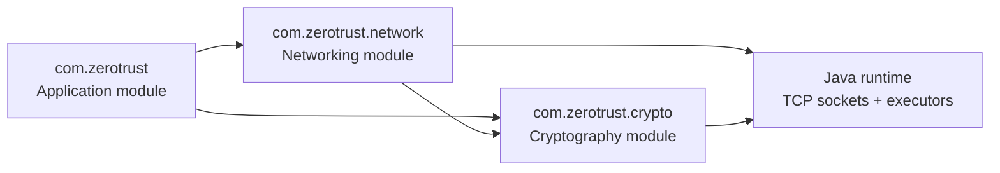
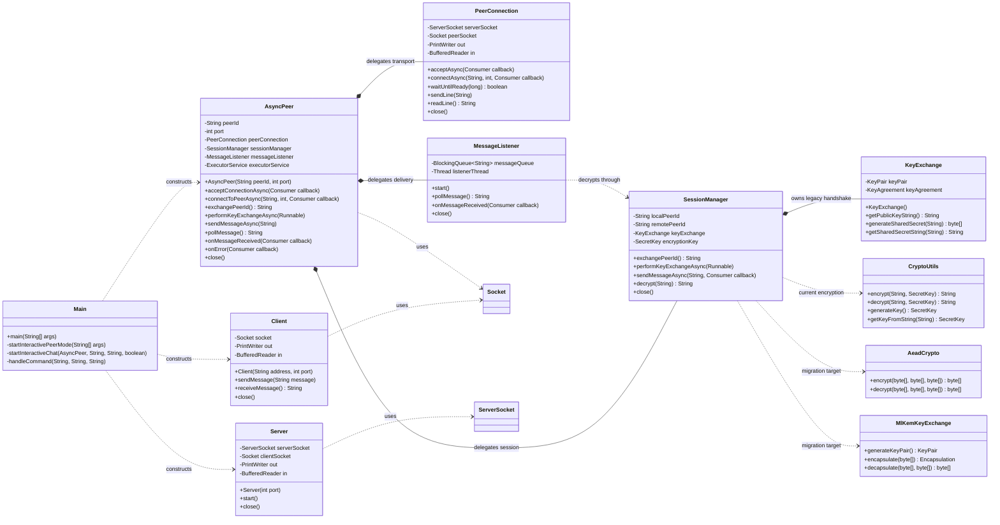
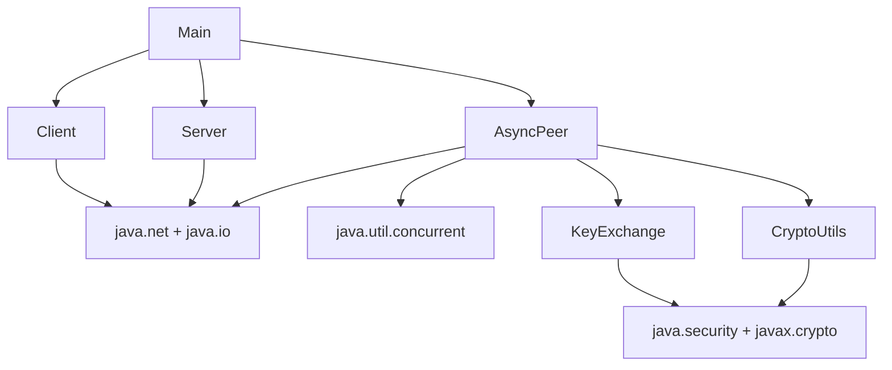

# Module-Level Design

This document describes the codebase at package, class, and interaction level. The diagrams are intentionally limited to classes and relationships that exist in `src/main/java`.

Design rationale and unresolved security gates are tracked in [Architecture and Security Decisions](decisions.md).

## Module map



### `com.zerotrust`

**Owner:** `Main`

Responsibilities:

- Parse command-line mode and positional arguments.
- Construct and coordinate `Client`, `Server`, or `AsyncPeer`.
- Run the terminal chat loop and interpret chat commands.
- Display status and errors to standard output/error.

This module is an application/composition layer. It should not own cryptographic primitives or socket framing logic.

### `com.zerotrust.network`

**Owners:** `Client`, `Server`, `AsyncPeer`, `PeerConnection`, `SessionManager`, and `MessageListener`

Responsibilities:

- Open and close TCP sockets through `PeerConnection`.
- Create line-oriented input/output streams and expose readiness through `PeerConnection`.
- Manage the legacy synchronous echo examples or asynchronous peer behavior.
- Coordinate connection callbacks, message queues, listener threads, and executor tasks through focused owners.
- Delegate identity exchange and session encryption to `SessionManager`.

The package currently contains two related but separate network paths:

| Network path | Classes | Characteristics |
| --- | --- | --- |
| Echo path | `Client`, `Server` | Synchronous, one client, plaintext, request/response. |
| Peer path | `AsyncPeer`, `PeerConnection`, `SessionManager`, `MessageListener` | Asynchronous connection setup, DH handshake, encrypted message sends, queue/callback delivery. |

### `com.zerotrust.crypto`

**Owners:** `CryptoUtils`, `KeyExchange`, `AeadCrypto`, and `MlKemKeyExchange`

Responsibilities:

- Generate and serialize DH key material.
- Compute the DH shared secret.
- Derive AES keys from shared-secret text.
- Encrypt and decrypt message strings.
- Provide explicit AES-256-GCM payload protection with nonces and associated data.
- Provide ML-KEM-768 key encapsulation and decapsulation through the pinned provider.

This module has no socket or CLI dependencies. `AeadCrypto` and `MlKemKeyExchange` are migration foundations and are not yet wired into the live `SessionManager`. Current algorithms and limitations are documented in [Security Notes](security.md).

## Implemented class diagram



`Main` is a coordinator rather than a service object. `AsyncPeer` owns module composition and the shared executor, while `PeerConnection`, `SessionManager`, and `MessageListener` own transport, session, and delivery state respectively.

## Dependency boundaries



### Allowed dependency direction

1. `Main` may depend on both network and crypto-facing application APIs.
2. `network` may depend on `crypto` and Java networking/concurrency APIs.
3. `crypto` should depend only on Java security/crypto APIs and utility classes.
4. `crypto` must not depend on `Main` or open sockets.
5. No module currently depends on persistence, external services, or a protocol/message model.

## Module responsibilities and ownership

| Class | Owns | Does not own |
| --- | --- | --- |
| `Main` | CLI arguments, chat UI, mode selection | Socket internals or cryptographic implementation. |
| `Client` | One outbound TCP connection and echo request/response | Encryption, retries, multiple connections. |
| `Server` | One listening socket, one accepted client, echo loop | Peer authentication or encrypted transport. |
| `AsyncPeer` | Peer socket, async tasks, handshake sequencing, queue, callbacks | A durable message store or authenticated identity. |
| `KeyExchange` | DH key pair and shared-secret computation | Socket I/O and message encryption. |
| `CryptoUtils` | AES operations, random AES key generation, SHA-256 derivation | Key exchange, identity, transport framing. |

## AsyncPeer state model

The implementation does not expose an enum state machine, but its behavior has these practical states:


Important sequencing rules:

- `waitForConnectionReady` is required after asynchronous accept/connect.
- Both peers should call `exchangePeerId` concurrently because each call writes before reading.
- Both peers should call `performKeyExchangeAsync` and wait for completion before sending application messages.
- `close` is terminal for the instance because it shuts down sockets and the executor.

## Message and callback paths

```mermaid
flowchart LR
    Send[sendMessageAsync]
    Encrypt{encryptionKey set?}
    Plain[Write plaintext line]
    Cipher[CryptoUtils.encrypt\nwrite Base64 ciphertext]
    Wire[(TCP line)
]
    Read[listenerThread readLine]
    Queue[messageQueue\nraw wire line]
    Process[executor task]
    Decrypt[CryptoUtils.decrypt]
    Callback[onMessageReceived\nplaintext]
    Poll[pollMessage\nraw wire line]

    Send --> Encrypt
    Encrypt -->|no| Plain
    Encrypt -->|yes| Cipher
    Plain --> Wire
    Cipher --> Wire
    Wire --> Read
    Read --> Queue
    Queue --> Poll
    Read --> Process
    Process --> Decrypt
    Decrypt --> Callback
```

The queue and callback are intentionally documented separately because they currently expose different values. `pollMessage()` returns the raw line placed into the queue; `onMessageReceived` receives the decrypted value when a key is available.

## Test-to-module mapping

| Test class | Module coverage |
| --- | --- |
| `CryptoUtilsTest` | AES encryption/decryption, generated keys, and SHA-256-derived keys. |
| `KeyExchangeTest` | DH public-key serialization and shared-secret agreement. |
| `AsyncPeerTest` | Network lifecycle, readiness, peer IDs, key exchange, callbacks, queueing, and cleanup. |

There are currently no dedicated tests for `Main`, the synchronous `Client`/`Server` echo path, malformed wire lines, authentication, replay, or protocol version negotiation.

## Related documents

- [High-level architecture](high-level-architecture.md) explains system boundaries and end-to-end flows.
- [Low-level design and API](low-level-design.md) documents public methods and wire shapes.
- [Security notes](security.md) describes cryptographic and protocol risks.
